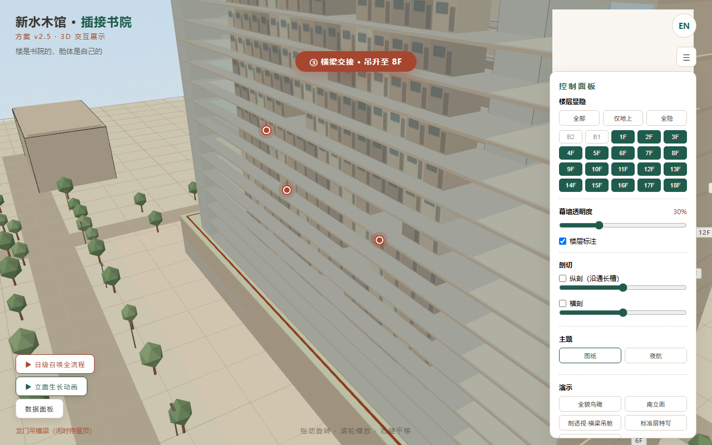
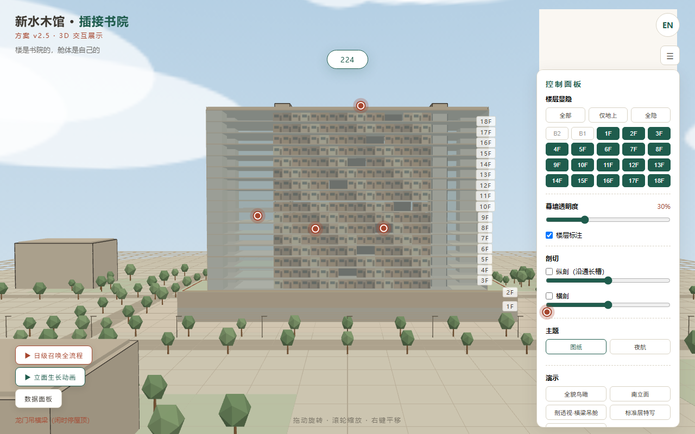
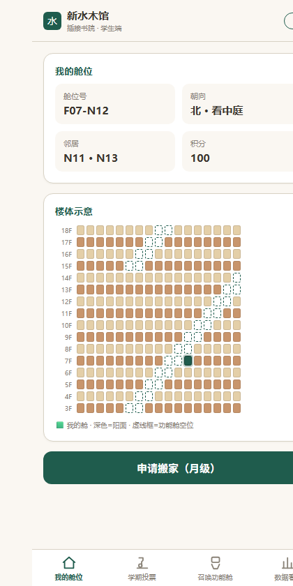
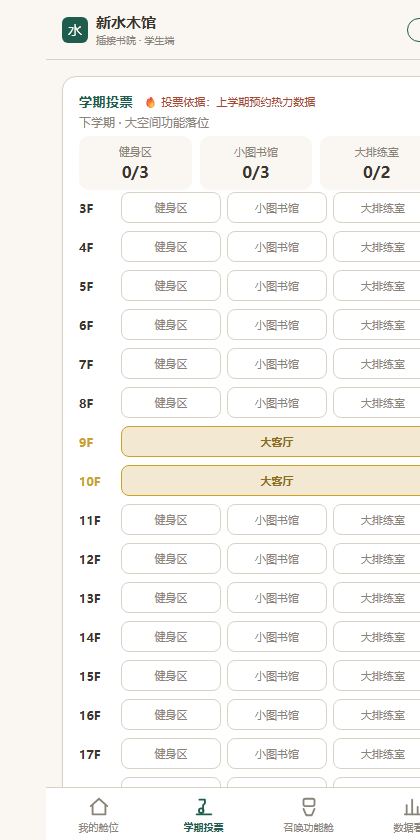
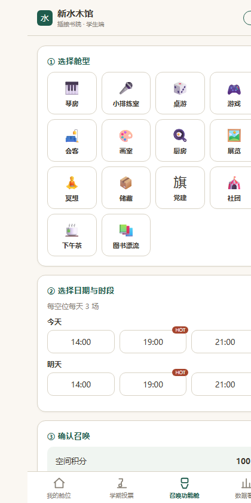
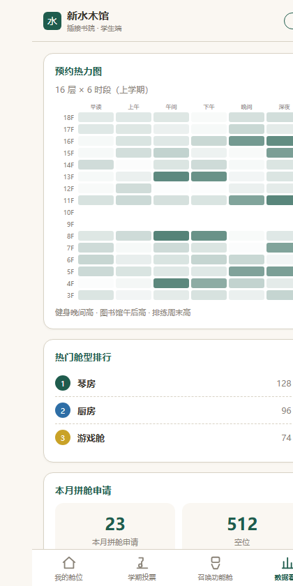

# 新水木馆 · 插接书院 — 3D 交互展示网页 & 模拟小程序

> 清华大学《未来工程创新设计》（2026 夏季学期）· 方向一：未来城市与校园 · 题目一：书院培养模式下学生宿舍设计与改造
>
> 把一栋"会换房间的宿舍楼"做成可以转、可以剖、可以召唤的网页。

**在线体验**

| 页面 | 地址 |
|---|---|
| 🏠 项目首页（推荐入口） | https://946983543293.github.io/xin-shuimu-hall/home.html |
| 🏛️ 3D 交互展示网页 | https://946983543293.github.io/xin-shuimu-hall/index.html |
| 📱 模拟小程序 | https://946983543293.github.io/xin-shuimu-hall/app.html |

> 3D 场景约 3 MB，建议在 WiFi 下打开；3D 网页推荐横屏（电脑 / 平板），小程序推荐竖屏（手机扫码即玩）。

---

## 预览

| 3D 交互展示 · 日级召唤全流程 | 3D 交互展示 · 立面生长 |
|---|---|
|  |  |

| 模拟小程序 · 我的舱位 | 学期投票 | 召唤功能舱 | 数据看板 |
|---|---|---|---|
|  |  |  |  |

---

## 一、这是什么

**新水木馆**是一栋为书院制培养模式设计的 16 层学生宿舍楼方案，核心创新是**把住宿空间从"固定房间"变成"可插拔的舱体"**：

- 楼体是一套**标准化的承载框架**（板楼塔身 + 每层 34 个舱位 + 中央运输通长槽）；
- 每个学生的**居住舱（3×4m）可以被整体吊装、搬移、替换**；
- 楼顶停着一套**"龙门吊"搬运系统**（双立柱 + 通长横梁 + 伸缩机械臂），它像立体车库一样，把舱体从地下仓库送到任意楼层的任意舱位。

由此实现**空间的三级更换**——这是整个方案最核心的设计思想：

| 级别 | 更换什么 | 谁来定 | 一句话 |
|---|---|---|---|
| **学期级** | 8 层公共大空间的**功能落位**（健身 / 小图书馆 / 大排练室各自放哪几层） | 全院投票 | "新学期开学，健身房定在 5 层" |
| **月级** | 我的**居住舱位置**（换阳面、换高楼、和朋友拼舱） | 本人申请 + 系统调度 | "搬去跟同学住一起" |
| **日级** | **功能舱**当天出现在本层（琴房、厨房、游戏舱…） | 小程序预约 | "晚上要用琴房，白天预约就能调过来" |

> 灵魂金句：**"楼是书院的，楼层是楼层的，舱体是自己的。"**
> **"一条横梁，调度整座书院的生活。"**
> **"空间不是被分配的，而是被召唤的。"**

本项目包含两个可交互产品，用来**把这个抽象机制演给人看**：

1. **3D 交互展示网页** —— 整栋楼的参数化立体模型，可转视角、可隐藏楼层、可剖切、可播放搬运与生长动画。
2. **模拟小程序** —— 手机端交互原型，完整演示"学期级 / 月级 / 日级"三级更换的真实操作流程。

---

## 二、3D 交互展示网页

一栋 **512 个舱体全部真实建模**的楼，所有几何由代码参数化生成——改一个数字，整栋楼即时重建。

### 看

- **全楼真实建模**：16 个居住层 × 34 个舱位（32 居住舱 + 1 个功能舱空位），512 个舱体、双立柱、57m 通长横梁、矩形基座、地下两层，全部按方案尺寸 1:1 生成。
- **周边校园场景**：道路、广场、约 110 棵树、7 栋周边建筑、路灯，让楼"长"在真实校园里。
- **双主题美学**：
  - **图纸主题**（浅）——米白底 `#FAF7F2` + 暖木舱体 + 细墨线，与设计图纸、展板完全一致；
  - **夜航主题**（深）——炭黑底 `#0E1116` + 青色描边微辉光 + 星空月亮 + 走廊灯带 + 40% 亮窗，答辩投影用。
- **天空系统**：白天有太阳与流云，夜晚有星空与月亮。

### 操作

- **自由漫游**：拖动旋转 · 滚轮缩放 · 右键平移。
- **楼层显隐**：一键"全部 / 仅地上 / 全隐"，把楼"拆开"看内部。
- **幕墙透明度**、**楼层标注**开关，随时看清室内关系。
- **5 个预设机位**：全貌鸟瞰 / 南立面 / 剖透视·横梁吊舱 / 标准层特写 / 基座屋顶庭院，一键切换。
- **剖切滑块**：沿通长槽**纵剖**、任意位置**横剖**，实时切开楼体看剖面。
- **楼层导引（3D 分层导览）**：B2 / B1 / 1F / 2F / 标准层各自贴上一张**精确平面图**，点击放大查看该层布局——像商场导览一样逛这栋楼。
- **热点信息卡**：6 处关键构造（龙门吊、通长槽、功能空位、基座等）点击弹出中英双语说明。
- **1:1 样板舱**：广场上放了一间全内饰的实体样板舱，走到近处可看居住舱内部。
- **高清截图导出**：一键导出 3200px PNG；正交机位截图可直接当立面图、剖切截图可直接当剖面图。

### 动（动画演示）

- **横梁吊舱演示**：龙门吊完整工作流程 8 阶段——降梁 → 小车对位 → 伸臂 → 推舱入位 → 复位。
- **日级召唤全流程**：B1 出库 → 立柱井平台升 3F → 横梁交接吊升 8F → 机械臂对位 → 推舱入位锁接 → "舱体就位"，六阶段字幕逐条推进。
- **立面生长动画**：512 个舱体从下到上一个一个插入楼体，约 18 秒，右侧实时计数——直观呈现"楼是被插满的"。
- **数据面板**：512 人 / 16 层 / 34 位、大空间配额色块、预约热力图、热门舱型，一屏看清全楼数据。

### 彩蛋

- **中英文一键切换**：全部文案集中在配置文件中，不写死在页面里。
- **纯净模式** `?clean=1`：隐藏所有界面元素，只留楼体——用于截图与效果图底图。
- **URL 参数直达**：`?preset=`（机位）、`?clipz=`（剖切）、`?guide=`（楼层导引）、`?flow=`（召唤动画）、`?grow=`（生长动画）、`?data=`（数据面板），方便演示与调试。

---

## 三、模拟小程序

手机端 H5 交互原型，**竖屏单页四页签**，完整演示三级空间更换的真实操作流程。

### 页 1 · 我的舱位 & 换舱大厅（月级）

- **我的舱位**：在 16 层 × 34 位的楼体网格中定位"我"的舱位（演示固定值 `F07-N12`），显示朝向（南向阳面 / 北向看中庭）与邻居。
- **换舱大厅**：一个月级**双向市场**——
  - 发布换舱需求（意向楼层范围 + 舱位号范围 + 只看阳面），消耗 5 空间积分；
  - 浏览公开需求，同意他人交换可获 8 积分奖励；
  - 无人应答时，系统自动兜底匹配最相近的舱位（演示快进）；
  - 成交后播放调舱动画并同步更新楼体网格。

### 页 2 · 学期投票（学期级）

- 投"下学期健身区 / 小图书馆 / 大排练室分别放在哪几层"。
- **硬约束**：健身恰好 3 层、小图书馆恰好 3 层、大排练室恰好 2 层；同层不可重复；**9F + 10F 的大客厅固定不可选**（灰色锁定）——不满足配额就不能提交。
- 提交后显示**全院实时票况**（本人 1 票 + 种子化伪随机 480 票聚合），并以"功能块飞入对应楼层"的动画公布结果。
- 提示投票依据：**上学期预约热力数据**——数据驱动决策。

### 页 3 · 召唤功能舱（日级）

- ① 选舱型（**14 种**：琴房 / 小排练室 / 桌游 / 游戏 / 会客 / 画室 / 厨房 / 展览 / 冥想 / 储藏 / 党建 / 社团 / 下午茶 / 图书漂流）
- ② 选日期与时段（今天 / 明天 × 每天 3 场：14:00 / 19:00 / 21:00）
- ③ 确认召唤 → 播放 **2D 龙门吊调舱动画**（B1 出库 → 垂直平台 → 横梁吊运 → 推送入位）→"**舱体已就位，扫码开门**"
- **积分规则**：每人每月 100 分；前 3 次免费；第 4 次起 10 分/次；19:00 热门时段 +5 分。本层时段被占用时，系统自动"**调配到相邻层（±1F）**"；积分不足则弹出规则卡。
- 设计意图：每层只有 1 个 6×4 功能舱空位 → **稀缺性 → 预约 + 积分防囤积 → 让空位流动起来**。

### 页 4 · 数据看板

- **预约热力图**（16 层 × 6 时段）、**热门舱型 Top 3**（琴房 / 厨房 / 游戏舱）、**本月拼舱申请 23 单**。
- 落点：数据驱动下学期投票与库存调整——形成"学生用 → 系统记 → 下学期投票定"的闭环。

> 所有模拟数据使用**固定种子 `20260911`**（答辩日）生成，保证每次演示结果完全一致、可复现。
> 同样支持中英文一键切换。

---

## 四、本地运行

本项目是**纯静态网页，无需构建、无任何网络依赖**——Three.js 等依赖全部本地化在 `lib/` 中。

- **Windows**：双击 `start.bat`，浏览器会自动打开本地地址。
- **任意系统**：在本目录起一个静态服务器即可（例如 `python -m http.server 8321`），再访问 `http://localhost:8321/home.html`。
- 也可直接双击 `home.html` 打开（不依赖服务器的场景）。

### 部署到 GitHub Pages

在仓库根目录放一个空的 `.nojekyll` 文件（阻止 Jekyll 处理），然后在仓库 Settings → Pages 选择分支根目录即可。

---

## 五、技术栈

| 项 | 说明 |
|---|---|
| 3D 引擎 | 原生 **Three.js**（本地化，无需 CDN） |
| 相机控制 | `OrbitControls` |
| 文字标注 | `CSS2DRenderer`（中文标注全部走 DOM，不依赖字体模型） |
| 数据来源 | **单一配置文件** `building.config.js`——所有尺寸、配色、i18n 文案、小程序数据仅在此定义一次 |
| 建模方式 | **程序化生成**：代码读取配置生成全部几何，改数字即整楼重建 |
| 小程序 | 原生 HTML/CSS/JS 单页应用，与 3D 网页共享同一份配置与配色 |
| 部署 | GitHub Pages（静态托管） |

**核心设计原则**：**数据与表现分离**。所有尺寸只写一次（`building.config.js`），几何、动画、小程序全部由数据驱动——这也是"插接"思想在代码上的对应。

### 目录结构

```
├── home.html            落地页（两个入口）
├── index.html           3D 交互展示网页
├── app.html             模拟小程序
├── building.config.js   ★ 唯一数据源（尺寸 / 色板 / i18n / 小程序数据）
├── start.bat            本地一键启动
├── src/
│   ├── main.js          主入口与主循环
│   ├── geometry.js      参数化几何生成（塔身/舱体/基座/地下/机械）
│   ├── interaction.js   视角交互与预设机位
│   ├── theme.js         双主题切换
│   ├── ui.js            控制面板与界面
│   ├── hotspots.js      热点标注信息卡
│   ├── guide.js         楼层导引（3D 分层导览）
│   └── p2.js            全流程 / 生长 / 数据面板动画
├── lib/                 Three.js 等本地依赖
├── assets/plans/        5 张精确平面图（楼层导引用）
└── exports/             截图与二维码导出（素材，运行不需要）
```

---

## 六、方案关键数据

| 项 | 数值 |
|---|---|
| 塔身 | **90m（东西）× 21m（南北）**，16 个居住层（3F–18F），层高 3.6m |
| 总高 | 约 **67.2m** |
| 基座 / 地下 | 108 × 25.2m；B1 舱体储运、B2 运动场馆 |
| 规模 | **512 人**（32 人/层 × 16 层） |
| 居住舱 | **3×4m**，净高约 3.0m，独立卫浴，门朝外廊 |
| 每层舱位 | 34 位 = 32 居住舱 + 1 个 6×4 功能舱空位（占 2 位） |
| 横向三带 | 2.4（北外廊）+ 4.0（北舱体）+ 8.2（中央带，含 5.0m 通长槽）+ 4.0（南舱体）+ 2.4（南外廊）= 21m |
| 纵向五段 | 21（西端服务）+ 5（西立柱）+ 47（舱体区）+ 5（东立柱）+ 12（东端客厅）= 90m |
| 龙门吊 | 双立柱 5×8.2m + 通长横梁跨度约 57m（最低作业面 3F，闲停屋顶）+ 伸缩机械臂 |
| 大空间配额 | 10 层集中配置：大客厅 2 层（9F+10F 固定）+ 健身 3 + 小图书馆 3 + 大排练室 2 |

---

## 七、视觉规范

整套作品的图纸、展板、网页、小程序使用**同一套色板**：

| 用途 | 色值 |
|---|---|
| 底色（米白） | `#FAF7F2` |
| 主绿（功能 / 强调） | `#1F5C4D` |
| 点缀橙红（机械 / 流线） | `#A6462E` |
| 舱体木色组 | `#D9B48A` `#E4CFA8` `#C8956C` `#B98A5A` `#A0785A` `#8F6B4A` |
| 夜航主题底 / 描边 | `#0E1116` / `#7FD4C1` |

字体：中文 Microsoft YaHei / PingFang SC。

---

## 八、关于本项目

- **课程**：清华大学《未来工程创新设计》2026 夏季学期 · 方向一：未来城市与校园
- **题目**：题目一：书院培养模式下学生宿舍设计与改造
- **指导教师**：石永久 · 祁炜 · 刘宛
- **项目名**：新水木馆（"插接书院"）
- **小组**：组长 李发烨；组员 徐睿泽、刘宇泽、焦宏宇

本项目为课程作业成果，3D 网页与模拟小程序作为方案的**数字化表达与交互原型**，与设计说明书、A2 设计图纸、实体模型、展板共同构成完整交付成果。
